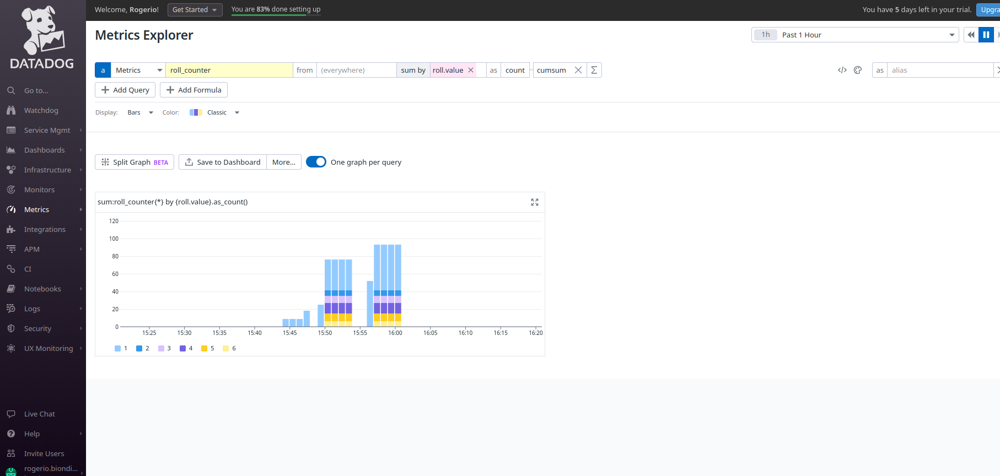

# open-telemetry
Open Telemetry Sample Implementation

# Pre-reqs

- GNU Make
- PyEnv
- Python 3.11
- Poetry
- Docker

# Architecture


# Installation
```
poetry install
```

# Run the application without instrumentation

```
make run-api
```

# Auto Instrumentation

```
make ot-auto
```

# Run the instrumented application

```
make ot-api
```

# Test

```
curl --location 'localhost:9090/roll_dice?dice=3&faces=6'
```

You'll get the results:

```
INFO:     127.0.0.1:54736 - "GET /roll_dice?dice=3&faces=6 HTTP/1.1" 200 OK
{
    "name": "do_roll",
    "context": {
        "trace_id": "0x76ff5161a410512251aee74b227274fa",
        "span_id": "0x8714be8e2d9a8065",
        "trace_state": "[]"
    },
    "kind": "SpanKind.INTERNAL",
    "parent_id": "0x1b1962f70791e1e4",
    "start_time": "2023-07-25T14:43:55.491134Z",
    "end_time": "2023-07-25T14:43:55.491261Z",
    "status": {
        "status_code": "UNSET"
    },
    "attributes": {
        "roll.value": 6
    },
    "events": [],
    "links": [],
    "resource": {
        "attributes": {
            "telemetry.sdk.language": "python",
            "telemetry.sdk.name": "opentelemetry",
            "telemetry.sdk.version": "1.19.0",
            "telemetry.auto.version": "0.40b0",
            "service.name": "unknown_service"
        },
        "schema_url": ""
    }
}
{
    "name": "do_roll",
    "context": {
        "trace_id": "0x76ff5161a410512251aee74b227274fa",
        "span_id": "0x77b98ccf0c1f1600",
        "trace_state": "[]"
    },
    "kind": "SpanKind.INTERNAL",
    "parent_id": "0x1b1962f70791e1e4",
    "start_time": "2023-07-25T14:43:55.491380Z",
    "end_time": "2023-07-25T14:43:55.491443Z",
    "status": {
        "status_code": "UNSET"
    },
    "attributes": {
        "roll.value": 1
    },
    "events": [],
    "links": [],
    "resource": {
        "attributes": {
            "telemetry.sdk.language": "python",
            "telemetry.sdk.name": "opentelemetry",
            "telemetry.sdk.version": "1.19.0",
            "telemetry.auto.version": "0.40b0",
            "service.name": "unknown_service"
        },
        "schema_url": ""
    }
}
{
    "name": "do_roll",
    "context": {
        "trace_id": "0x76ff5161a410512251aee74b227274fa",
        "span_id": "0x97245107f286162c",
        "trace_state": "[]"
    },
    "kind": "SpanKind.INTERNAL",
    "parent_id": "0x1b1962f70791e1e4",
    "start_time": "2023-07-25T14:43:55.491538Z",
    "end_time": "2023-07-25T14:43:55.491585Z",
    "status": {
        "status_code": "UNSET"
    },
    "attributes": {
        "roll.value": 5
    },
    "events": [],
    "links": [],
    "resource": {
        "attributes": {
            "telemetry.sdk.language": "python",
            "telemetry.sdk.name": "opentelemetry",
            "telemetry.sdk.version": "1.19.0",
            "telemetry.auto.version": "0.40b0",
            "service.name": "unknown_service"
        },
        "schema_url": ""
    }
}
{
    "name": "GET /roll_dice http send",
    "context": {
        "trace_id": "0x76ff5161a410512251aee74b227274fa",
        "span_id": "0x55abff4b7f73846a",
        "trace_state": "[]"
    },
    "kind": "SpanKind.INTERNAL",
    "parent_id": "0x1b1962f70791e1e4",
    "start_time": "2023-07-25T14:43:55.492101Z",
    "end_time": "2023-07-25T14:43:55.492540Z",
    "status": {
        "status_code": "UNSET"
    },
    "attributes": {
        "http.status_code": 200,
        "type": "http.response.start"
    },
    "events": [],
    "links": [],
    "resource": {
        "attributes": {
            "telemetry.sdk.language": "python",
            "telemetry.sdk.name": "opentelemetry",
            "telemetry.sdk.version": "1.19.0",
            "telemetry.auto.version": "0.40b0",
            "service.name": "unknown_service"
        },
        "schema_url": ""
    }
}
{
    "name": "GET /roll_dice http send",
    "context": {
        "trace_id": "0x76ff5161a410512251aee74b227274fa",
        "span_id": "0xfd6f03a980e45263",
        "trace_state": "[]"
    },
    "kind": "SpanKind.INTERNAL",
    "parent_id": "0x1b1962f70791e1e4",
    "start_time": "2023-07-25T14:43:55.492632Z",
    "end_time": "2023-07-25T14:43:55.492698Z",
    "status": {
        "status_code": "UNSET"
    },
    "attributes": {
        "type": "http.response.body"
    },
    "events": [],
    "links": [],
    "resource": {
        "attributes": {
            "telemetry.sdk.language": "python",
            "telemetry.sdk.name": "opentelemetry",
            "telemetry.sdk.version": "1.19.0",
            "telemetry.auto.version": "0.40b0",
            "service.name": "unknown_service"
        },
        "schema_url": ""
    }
}
{
    "name": "GET /roll_dice",
    "context": {
        "trace_id": "0x76ff5161a410512251aee74b227274fa",
        "span_id": "0x1b1962f70791e1e4",
        "trace_state": "[]"
    },
    "kind": "SpanKind.SERVER",
    "parent_id": null,
    "start_time": "2023-07-25T14:43:55.490143Z",
    "end_time": "2023-07-25T14:43:55.492728Z",
    "status": {
        "status_code": "UNSET"
    },
    "attributes": {
        "http.scheme": "http",
        "http.host": "127.0.0.1:9090",
        "net.host.port": 9090,
        "http.flavor": "1.1",
        "http.target": "/roll_dice",
        "http.url": "http://127.0.0.1:9090/roll_dice?dice=3&faces=6",
        "http.method": "GET",
        "http.server_name": "localhost:9090",
        "http.user_agent": "PostmanRuntime/7.32.3",
        "net.peer.ip": "127.0.0.1",
        "net.peer.port": 54736,
        "http.route": "/roll_dice",
        "http.status_code": 200
    },
    "events": [],
    "links": [],
    "resource": {
        "attributes": {
            "telemetry.sdk.language": "python",
            "telemetry.sdk.name": "opentelemetry",
            "telemetry.sdk.version": "1.19.0",
            "telemetry.auto.version": "0.40b0",
            "service.name": "unknown_service"
        },
        "schema_url": ""
    }
}
```

## Using an external data collector

The use of a data collector is recommended when there are several services to be instrumented.

### Running the collector

```
make ot-collector
```

### Running the service through the collector

```
make ot-api-collect
```

The `localhost:4317` is the default collection server. You can change it via environment variable or opentelemetry-instrument key.

Output:

```
Metric #0
Descriptor:
     -> Name: roll_counter
     -> Description: Number of rools by roll value
     -> Unit: 
     -> DataType: Sum
     -> IsMonotonic: true
     -> AggregationTemporality: Cumulative
NumberDataPoints #0
Data point attributes:
     -> roll.value: Int(4)
StartTimestamp: 2023-07-25 14:52:10.751285324 +0000 UTC
Timestamp: 2023-07-25 14:52:51.710662334 +0000 UTC
Value: 2
```

### Run Datadog collector

Further information:

https://docs.datadoghq.com/opentelemetry/otel_collector_datadog_exporter/


1) Configure your `.env` file as follows:

```
OTEL_SERVICE_NAME="dice_roll"
DD_SITE=<your site>
DD_API_KEY=<your api key>
```

2) Go to Datadog Console and create an API Key.

3) Configure your `otel-collector-datadog-config.yaml` with your API key.

4) Run the collector

```
make ot-collector-datadog
```

5) Run the instrumented API

```
make ot-collector-datadog

```
6) Test the app

```
curl --location 'localhost:9090/roll_dice?dice=3&faces=6'
```

7) Check data in datadog console:


